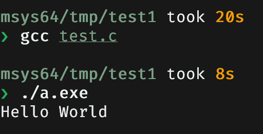
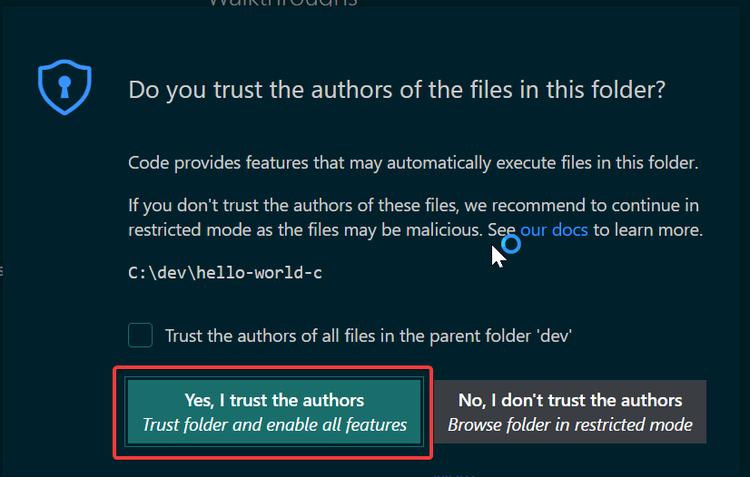

In this post, I'm sharing my experience to set up a C development environment on Windows. I'm installing [GCC](https://gcc.gnu.org/) from the [MSYS2](https://msys2.org) project and using [Visual Studio Code](https://code.visualstudio.com/) as my IDE.

## Install MSYS2

MSYS2 is a project which provides a collection of tools for building native Windows software. [See this documentation for learning more about it.](https://www.msys2.org/docs/what-is-msys2/) I have installed MSYS2 as explained on [the installation page](https://www.msys2.org/#installation) using the installer in the default location.

### Installing Toolchain

After installing the base MSYS2 installation, I installed the toolchain for the MINGW64 environment. For that, I did the following steps:

1. Open "MSYS2 MSYS" from Start menu.

2. Run the following command:
    ```bash
    $ pacman -S --needed base-devel mingw-w64-x86_64-toolchain
    warning: file-5.39-2 is up to date -- skipping
    [... more warnings ...]
    :: There are 48 members in group base-devel:
    :: Repository msys
       1) asciidoc  2) autoconf  3) autoconf2.13  4) autogen
       [... more packages listed ...]
    
    Enter a selection (default=all):
    :: There are 19 members in group mingw-w64-x86_64-toolchain:
    :: Repository mingw64
       1) mingw-w64-x86_64-binutils  2) mingw-w64-x86_64-crt-git
       [... more packages listed ...]
    
    Enter a selection (default=all):
    resolving dependencies...
    looking for conflicting packages...
    
    Packages (123) docbook-xml-4.5-2  docbook-xsl-1.79.2-1
                   [... more packages listed ...]
                   m4-1.4.18-2  make-4.3-1  man-db-2.9.3-1
                   mingw-w64-x86_64-binutils-2.35.1-3
                   mingw-w64-x86_64-crt-git-9.0.0.6090.ad98746a-1
                   mingw-w64-x86_64-gcc-10.2.0-6
                   mingw-w64-x86_64-gcc-ada-10.2.0-6
                   mingw-w64-x86_64-gcc-fortran-10.2.0-6
                   mingw-w64-x86_64-gcc-libgfortran-10.2.0-6
                   mingw-w64-x86_64-gcc-libs-10.2.0-6
                   mingw-w64-x86_64-gcc-objc-10.2.0-6
                   mingw-w64-x86_64-gdb-10.1-2
                   mingw-w64-x86_64-gdb-multiarch-10.1-2
                  [... more packages listed ...]
    
    Total Download Size:    196.15 MiB
    Total Installed Size:  1254.96 MiB
    
    :: Proceed with installation? [Y/n]
    [... downloading and installation continues ...]
    ```

### Verifying Toolchain

1. Open "MSYS MinGW 64-bit" from start menu.

2. Verify that `gcc --version` works.
	```bash
	$ gcc --version
	gcc.exe (Rev10, Built by MSYS2 project) 11.2.0
   Copyright (C) 2021 Free Software Foundation, Inc.
   This is free software; see the source for copying conditions.  There is NO
   warranty; not even for MERCHANTABILITY or FITNESS FOR A PARTICULAR PURPOSE.
   ```
   
   
3. Compile a test program:
	```c
	#include <stdio.h>
	int main(){
		printf("Hello World\n");
	}
	```
	Save the test program to `test.c` and then run `gcc test.c` in the same shell and then run the executable by `./a.exe`.
	
	```bash
	~ took 20s
	❯ gcc test.c
	
	~ took 8s
	❯ ./a.exe
	Hello World
	```
	
	

If everything works as expected then follow next steps. If something seems broken and doesn't work, please ask in `#help` at [MSYS2's discord server](https://discord.gg/jPQdRdDcT9).

## Configuring Visual Studio Code

Open Visual Studio Code (VSCode). Typing <kbd>Win + R</kbd> and typing entering `code` should open it. Or you can open it by searching it in the start menu.

### Install Extensions

[Install](https://code.visualstudio.com/docs/editor/extension-marketplace) the [C/C++](https://marketplace.visualstudio.com/items?itemName=ms-vscode.cpptools) extension for Visual Studio Code.

You can install the C/C++ extension by searching for 'c++' in the Extensions view <kbd>Ctrl+Shift+X</kbd>.

### Creating a hello world project

Create a hello world project (or open a project you already have):
```sh
mkdir projects
cd projects
mkdir helloworld
cd helloworld
code .
```
The "code ." command opens VS Code in the current working folder, which becomes your "workspace". Accept the [Workspace Trust dialog](https://code.visualstudio.com/docs/editor/workspace-trust) by selecting "Yes", I trust the authors since this is a folder you created.



Also, create a file `helloworld.c` with the following "Hello World" code:

```c
#include <stdio.h>
int main(){
	printf("Hello World");
}
```

### Configuring Visual Studio Code to use GCC compiler

Open the Command Palette (`Ctrl+Shift+P`) and the select **C/C++: Edit Configurations (UI)**. Change the **Configuration name** to **GCC**, set the **Compiler path** dropdown to the gcc compiler (`C:/msys64/mingw64/bin/gcc.exe`), and the **IntelliSense mode** to match the compiler (**windows-gcc-x64**).

The JSON file (`.vscode/c_cpp_properties.json`) in the end should look like this:

```json
{
    "configurations": [
        {
            "name": "GCC",
            "includePath": [
                "${default}"
            ],
            "defines": [
                "_DEBUG",
                "UNICODE",
                "_UNICODE"
            ],
            "compilerPath": "C:/msys64/mingw64/bin/gcc.exe",
            "cStandard": "c17",
            "cppStandard": "c++17",
            "intelliSenseMode": "windows-gcc-x64"
        }
    ],
    "version": 4
}
```

This should enable [Intellisense](https://en.wikipedia.org/wiki/Intelligent_code_completion#IntelliSense).

### Configuring `tasks.json`

This file is used to tell VS Code how to build (compile) the program. This task will invoke the `gcc` compiler to create an executable file based on the source code.

From the main menu, choose `Terminal > Configure Default Build Task`. In the dropdown, which will display a tasks dropdown listing various predefined build tasks for C compilers. Choose `gcc.exe` build active file, which will build the file that is currently displayed (active) in the editor.


This will create a `tasks.json` file in a `.vscode` folder and open it in the editor, modify the file as required.

You can now build your source file by using <kbd>Ctrl+Shift+B</kbd> and run it by opening a terminal inside VSCode and runnning `.\helloworld.exe`.

### Setting up Debugger

This steps will configure Visual Studio Code to use GDB debugger when you press `F5` to debug  the program.

1. From the main menu, choose 	`Run > Add Configuration...` and then choose `C++ (GDB/LLDB)`.
2. Click on "Add Configuration" and select "C/C++: (gdb) Launch". The creates `launch.json` and opens it.
3. Edit the file to change the key `miDebuggerPath` to the actual executable of GDB (`C:\\msys64\\mingw64\\bin\\gdb.exe`). 
4. Edit the file to change the key `program` to `${fileDirname}\\${fileBasenameNoExtension}.exe`.
4. Again, edit the file to add the below code to the end, so that the file you edit is actually built before running the debugger.
```json
"preLaunchTask": "C/C++: gcc.exe build active file"
```


The `launch.json` looks like this in the end

```json
{
    "version": "0.2.0",
    "configurations": [
        {
            "name": "(gdb) Launch",
            "type": "cppdbg",
            "request": "launch",
            "program": "${fileDirname}\\${fileBasenameNoExtension}.exe",
            "args": [],
            "stopAtEntry": false,
            "cwd": "${fileDirname}",
            "environment": [],
            "externalConsole": false,
            "MIMode": "gdb",
            "miDebuggerPath": "C:\\msys64\\mingw64\\bin\\gdb.exe",
            "setupCommands": [
                {
                    "description": "Enable pretty-printing for gdb",
                    "text": "-enable-pretty-printing",
                    "ignoreFailures": true
                },
                {
                    "description":  "Set Disassembly Flavor to Intel",
                    "text": "-gdb-set disassembly-flavor intel",
                    "ignoreFailures": true
                }
            ],
            "preLaunchTask": "C/C++: gcc.exe build active file"
        }
    ]
}
```

After this, you can have a look at [Visual Studio Code's docs](https://code.visualstudio.com/docs/cpp/config-mingw#_debug-helloworldcpp) on how to debug.

Hope this helps you in configuring Visual Studio Code for setting up a development environment for C. If you have an error, or found something to difficult to  understand, jump over to `#help` on [MSYS2's Discord server](https://discord.gg/jPQdRdDcT9).
